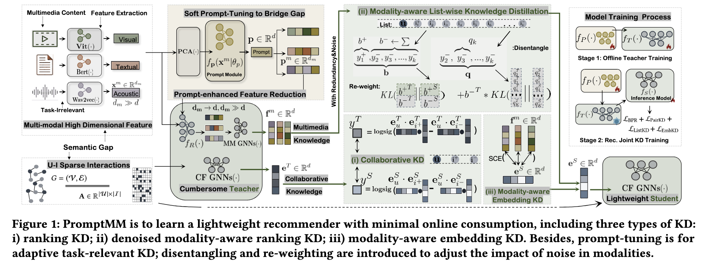
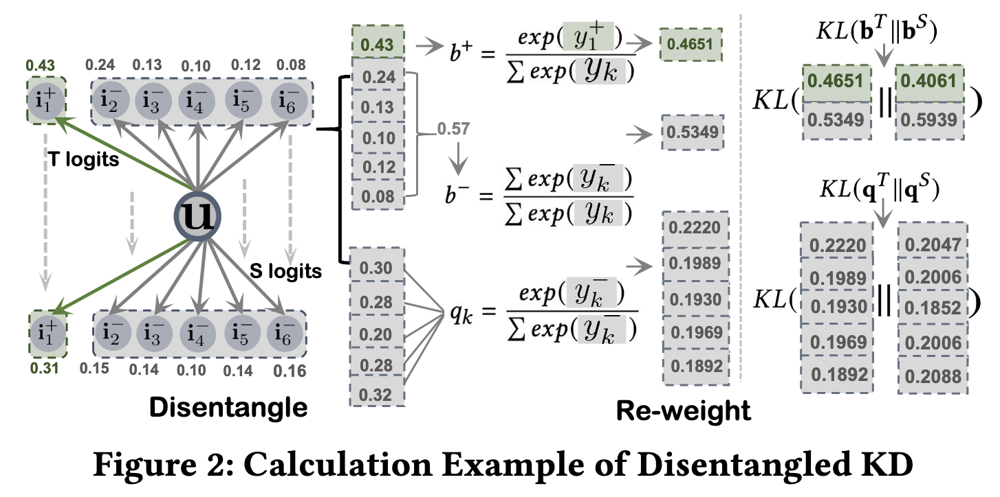

# PromptMM: Multi-Modal Knowledge Distillation for Recommendation with Prompt-Tuning

PyTorch implementation for WWW 2023 paper [PromptMM: Multi-Modal Knowledge Distillation for Recommendation with Prompt-Tuning](https://arxiv.org/html/2402.17188v1).

[Wei Wei](#), [Jiabin Tang](https://tjb-tech.github.io/), [Yangqin Jiang](#), [Lianghao Xia](https://akaxlh.github.io/) and [Chao Huang](https://sites.google.com/view/chaoh/home)*.
(*Correspondence)

<p align="center">

</p>


<h2>Dependencies </h2>

* Python >= 3.9.13
* [Pytorch](https://pytorch.org/) >= 1.13.0+cu116
* [dgl-cuda11.6](https://www.dgl.ai/) >= 0.9.1post1


<h2>Usage </h2>

Start training and inference as:

```
python ./main.py --dataset {DATASET}
```
Supported datasets:  `Amazon-Electronics`, `Netflix`, `Tiktok`


<h2> Datasets </h2>

  ```
  ├─ MMSSL/ 
      ├── data/
        ├── tiktok/
        ...
  ```
|   Dataset   |   |  Netflix |     |   |  Tiktok  |     |     |   | Electronics |      |
|:-----------:|:-:|:--------:|:---:|:-:|:--------:|:---:|:---:|:-:|:-----------:|:----:|
|   Modality  |   |     V    |  T  |   |     V    |  A  |  T  |   |      V      |   T  |
|  Feat. Dim. |   |    512   | 768 |   |    128   | 128 | 768 |   |     4096    | 1024 |
|     User    |   |  43,739  |     |   |  14,343  |     |     |   |    41,691   |      |
|     Item    |   |  17,239  |     |   |   8,690  |     |     |   |    21,479   |      |
| Interaction |   |  609,341 |     |   |  276,637 |     |     |   |   359,165   |      |
|   Sparsity  |   | 99.919\% |     |   | 99.778\% |     |     |   |   99.960\%  |      |


- `2024.2.27 new multi-modal datastes uploaded`: 📢📢 🌹🌹 We provide new multi-modal datasets `Netflix` and `MovieLens`  (i.e., CF training data, multi-modal data including `item text` and `posters`) of new multi-modal work [LLMRec](https://github.com/HKUDS/LLMRec) on Google Drive. 🌹We hope to contribute to our community and facilitate your research~

- `2023.2.27 update(all datasets uploaded)`: We provide the processed data at [Google Drive](https://drive.google.com/drive/folders/17vnX8S6a_68xzML1tAM5m9YsQyKZ1UKb?usp=share_link). 

🚀🚀 The provided dataset is compatible with multi-modal recommender models such as [MMSSL](https://github.com/HKUDS/MMSSL), [LATTICE](https://github.com/CRIPAC-DIG/LATTICE), and [MICRO](https://github.com/CRIPAC-DIG/MICRO) and requires no additional data preprocessing, including (1) basic user-item interactions and (2) multi-modal features.

```
# part of data preprocessing
# #----json2mat--------------------------------------------------------------------------------------------------
import json
from scipy.sparse import csr_matrix
import pickle
import numpy as np
n_user, n_item = 39387, 23033
f = open('/home/weiw/Code/MM/MMSSL/data/clothing/train.json', 'r')  
train = json.load(f)
row, col = [], []
for index, value in enumerate(train.keys()):
    for i in range(len(train[value])):
        row.append(int(value))
        col.append(train[value][i])
data = np.ones(len(row))
train_mat = csr_matrix((data, (row, col)), shape=(n_user, n_item))
pickle.dump(train_mat, open('./train_mat', 'wb'))  
# # ----json2mat--------------------------------------------------------------------------------------------------


# ----mat2json--------------------------------------------------------------------------------------------------
# train_mat = pickle.load(open('./train_mat', 'rb'))
test_mat = pickle.load(open('./test_mat', 'rb'))
# val_mat = pickle.load(open('./val_mat', 'rb'))

# total_mat = train_mat + test_mat + val_mat
total_mat =test_mat

# total_mat = pickle.load(open('./new_mat','rb'))
# total_mat = pickle.load(open('./new_mat','rb'))
total_array = total_mat.toarray()
total_dict = {}

for i in range(total_array.shape[0]):
    total_dict[str(i)] = [index for index, value in enumerate(total_array[i]) if value!=0]

new_total_dict = {}

for i in range(len(total_dict)):
    # if len(total_dict[str(i)])>1:
    new_total_dict[str(i)]=total_dict[str(i)]

# train_dict, test_dict = {}, {}

# for i in range(len(new_total_dict)):
#     train_dict[str(i)] = total_dict[str(i)][:-1]
#     test_dict[str(i)] = [total_dict[str(i)][-1]]

# train_json_str = json.dumps(train_dict)
test_json_str = json.dumps(new_total_dict)

# with open('./new_train.json', 'w') as json_file:
# # with open('./new_train_json', 'w') as json_file:
#     json_file.write(train_json_str)
with open('./test.json', 'w') as test_file:
# with open('./new_test_json', 'w') as test_file:
    test_file.write(test_json_str)
# ----mat2json--------------------------------------------------------------------------------------------------
```


<p align="center">

</p>


## Acknowledgement

## Acknowledgement

The structure of this code is largely based on [LATTICE](https://github.com/CRIPAC-DIG/LATTICE), [MICRO](https://github.com/CRIPAC-DIG/MICRO). Thank them for their work.

